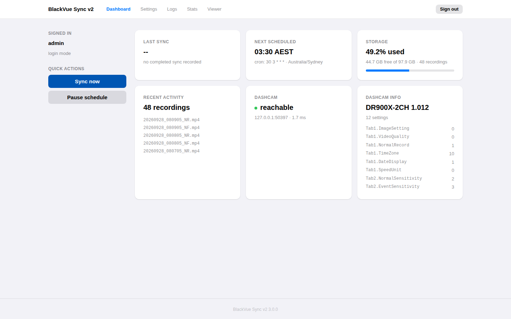
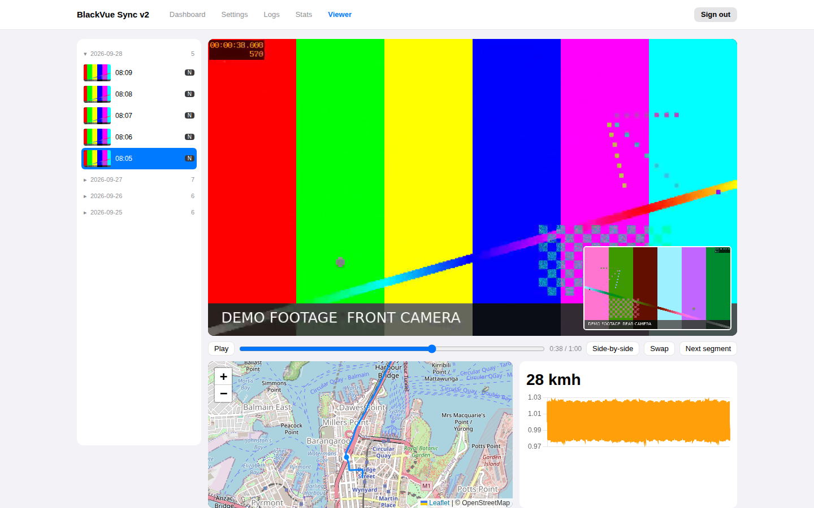

# BlackVue Sync v2

[](https://github.com/tekgnosis-net/blackvuesync-v2/actions/workflows/ci.yml)
[](https://github.com/tekgnosis-net/blackvuesync-v2/actions/workflows/docker-build.yml)
[](https://tekgnosis-net.github.io/blackvuesync-v2/)

Hands-off synchronization of BlackVue dashcam recordings to a folder on your
own server, with a web dashboard, a recording viewer and sync statistics.

**Documentation: <https://tekgnosis-net.github.io/blackvuesync-v2/>**





## Features

* **Automatic, incremental downloads** on a schedule, resuming interrupted
  files where they stopped.
* **Retention and disk safety**: deletes recordings older than a set period and
  stops before the disk fills.
* **Web interface**: live progress with Sync now, Stop and Pause; settings
  editor; live logs; statistics with a disk forecast.
* **Recording viewer**: front and rear together, GPS track on a map, speed and
  G-sensor, continuous playback through a drive. Handles libraries of tens of
  thousands of recordings.
* **Authentication** by password, reverse proxy, or none on a trusted network.
* **Prometheus metrics** and a **command line** for one-off or cron syncs.
* **Docker images** for amd64 and arm64.

## Quick start

```yaml
services:
  blackvuesync-v2:
    image: ghcr.io/tekgnosis-net/blackvuesync-v2:3
    container_name: blackvuesync-v2
    restart: unless-stopped
    ports:
      - "8080:8080"
    volumes:
      - /data/dashcam:/recordings
      - ./config:/config
    environment:
      ADDRESS: 192.168.1.50  # your dashcam
      PUID: 1000
      PGID: 1000
      TZ: Australia/Sydney
      BLACKVUESYNC_TIMEZONE: Australia/Sydney
```

Run `docker compose up -d`, open `http://<server>:8080/`, set an admin
password and press **Sync now**.

| Guide | |
| --- | --- |
| [Installation](https://tekgnosis-net.github.io/blackvuesync-v2/guide/installation/) | Docker, Compose, pip, reverse proxies |
| [Configuration](https://tekgnosis-net.github.io/blackvuesync-v2/guide/configuration/) | Every setting and environment variable |
| [Command line](https://tekgnosis-net.github.io/blackvuesync-v2/guide/cli/) | One-off and cron syncs, Prometheus |
| [Upgrading](https://tekgnosis-net.github.io/blackvuesync-v2/guide/upgrading/) | Updates, image tags, moving from earlier versions |
| [Troubleshooting](https://tekgnosis-net.github.io/blackvuesync-v2/guide/troubleshooting/) | Common errors and fixes |
| [Release notes](https://tekgnosis-net.github.io/blackvuesync-v2/release-notes/) | What changed in each version |

## Credits

BlackVue Sync v2 is built on
[BlackVue Sync](https://github.com/acolomba/blackvuesync), created by
[Alessandro Colomba](https://github.com/acolomba) in 2018. Thank you,
Alessandro, and thank you to the upstream contributors. The sync engine, the
recording-name parsing, retention and the command line are their work. v2
began as a fork in 2026, adds the web service around that engine, and became a
separate project with release 3.0.0. It uses different package, command and
image names, so both can be installed side by side.
See [Credits](https://tekgnosis-net.github.io/blackvuesync-v2/credits/).

## License

This project is licensed under the MIT License; see the [COPYING](COPYING)
file.

Copyright 2018-2026 [Alessandro Colomba](https://github.com/acolomba)

v2 additions copyright 2026 [tekgnosis-net](https://github.com/tekgnosis-net),
under the same MIT license.
