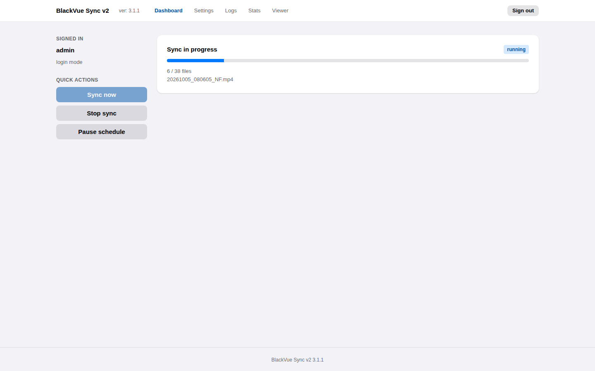
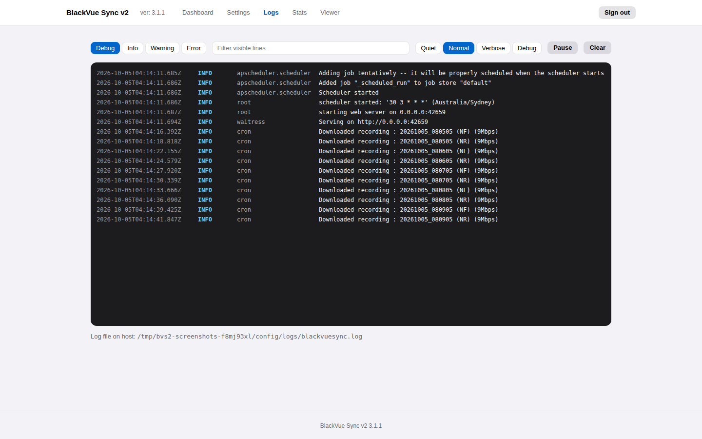
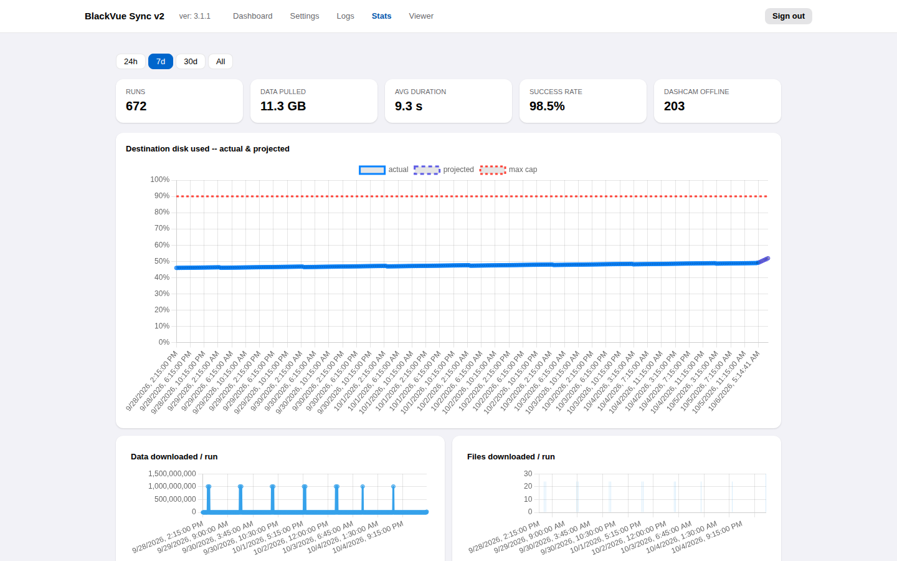
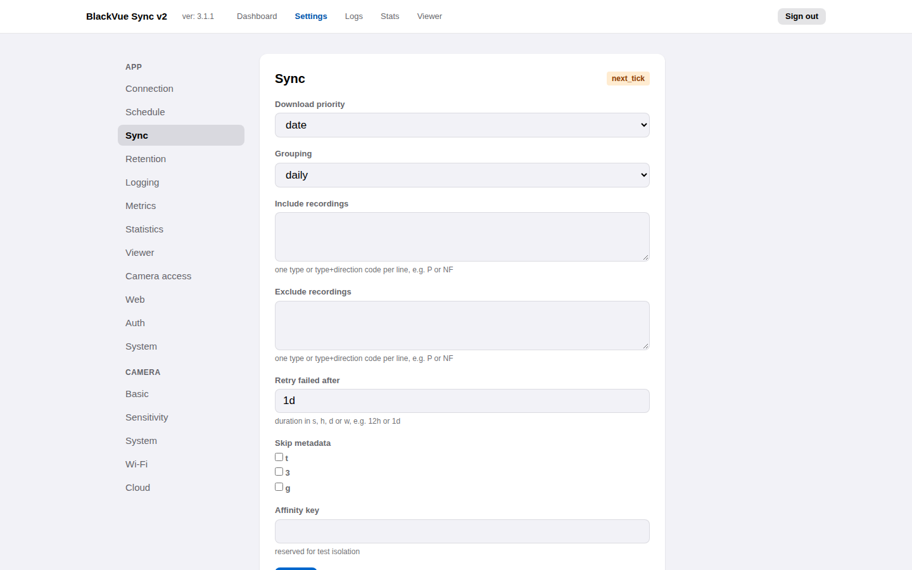
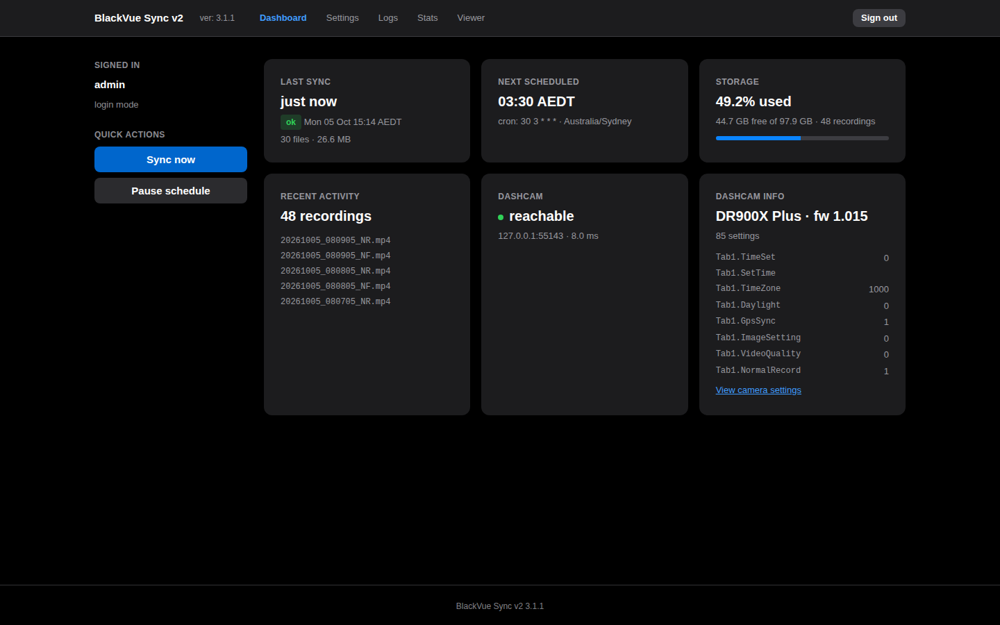
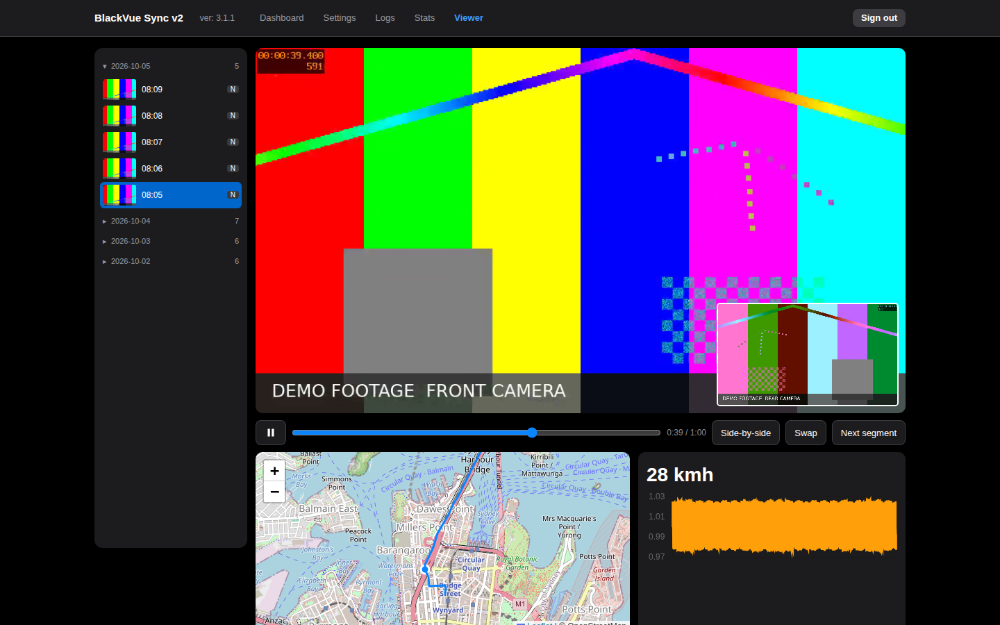

# Features

The screenshots on this page come from a demo instance with generated test
footage, a made-up drive across the Sydney Harbour Bridge and invented sync
history. They are regenerated with `python scripts/screenshots.py`.

## Dashboard

The dashboard shows the last sync, the next scheduled run, disk usage, the
dashcam's reachability and model, and the most recent recordings.
**Sync now** starts a sync immediately; **Pause schedule** stops scheduled
runs without stopping the service.

While a sync runs, the dashboard switches to live progress:

Progress updates several times a second. **Stop sync** stops after the current
chunk; the partial file is kept and resumed next time.

## Recording viewer

- Days are listed newest first; open a day to see its recordings. Libraries
  with tens of thousands of recordings load in a couple of seconds.
- Front and rear play together, picture-in-picture or side by side.
- The GPS track is drawn on an OpenStreetMap map with a marker that follows
  the video, alongside speed and a G-sensor chart.
- Consecutive recordings of one drive play one after another, and the list
  follows along. With **Continuous play** on, event (E) and parking (P)
  segments within a drive play too; otherwise only segments of the type you
  selected do.

## Logs

A live tail of the service log. Filter by level or text, change how much is
recorded (quiet to debug) without a restart, and pause the stream to read.
The same log is written to `/config/logs/`.

## Statistics

Every sync is recorded: runs, data downloaded, duration and success rate over
24 hours, 7 days, 30 days or all time. Runs made while the car was away are
counted separately as **Dashcam offline** and do not lower the success rate,
which covers only runs that reached the dashcam. The disk chart projects when the
destination reaches its limit, taking retention into account.

## Settings

Every setting is editable in the browser and validated before it is saved.
Most changes apply immediately or at the next sync; the few that need a
restart are marked. See [Configuration](guide/configuration.md).

## Camera settings

Every setting stored on the dashcam, shown under **Settings → Camera** in the
same groups as the BlackVue app, with Wi-Fi passwords masked behind an eye icon.
See [Camera settings](guide/camera-settings.md).

## Dark mode

The interface follows the system's light or dark appearance, including
browser-drawn controls such as buttons, sliders and scroll bars. Text meets the
WCAG AA contrast ratio (4.5:1) in both modes.

## Also included

- **Authentication**: a password with Argon2id hashing, login through a
  reverse proxy, or no login on a trusted network.
- **Prometheus metrics** to a file or a Pushgateway.
- **A command line** for one-off and cron syncs, compatible with the original
  BlackVue Sync options. See [Command line](guide/cli.md).
- **Docker images** for amd64 and arm64 with a health check.
