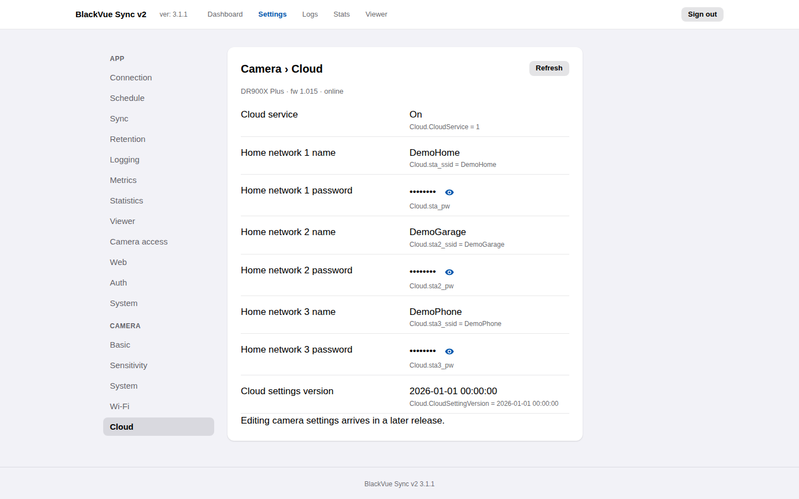

# Camera settings

**Settings → Camera** shows every setting stored on the dashcam itself, grouped
the way the BlackVue app groups them: **Basic**, **Sensitivity**, **System**,
**Wi-Fi** and **Cloud**. This release shows them read-only; changing them from
here arrives in a later release.

## Reading the camera

The panes read the camera's `Config/config.ini` every time the Settings page
loads, and when you press **Refresh**. They wait up to
`camera.read_timeout_seconds` (see [Configuration](configuration.md#camera-access))
for each of the two files they read, so a slow or absent camera can delay the
panes by up to about twice that. When the car is away, they show the settings
from the last successful read and say when that was.

The app keeps a copy of that settings file under `<config dir>/camera/` (mode
`0600`). It includes the Wi-Fi passwords in the camera's encrypted form, which
anyone can decrypt with the public BlackVue key, so treat that folder like the
camera itself when sharing backups or bug reports.

If you change a setting in the BlackVue app and press **Refresh**, the panes
list what changed on the camera since the last read.

## Wi-Fi passwords

The camera hotspot password and the three home-network passwords are masked.
Select the eye icon to show one; select it again to hide it. The camera stores
these passwords encrypted with a key built into the BlackVue app. That key is
public, so the app treats them like any other secret: masked by default, never
logged, never sent unless you ask to see one.

Keys that the app does not know but that are named like passwords (ending in
`_pw`, or containing `password`, `passwd` or `pwd`) are masked too, so a future
firmware cannot leak one by adding it.

If authentication is off (`auth.mode` `none`), anyone who can open the app can
reveal them. That is no wider than the camera itself, which serves its settings
file to anyone on your network.

## Settings that erase recordings

Settings marked **erases camera recordings** (the time settings and image
quality) make the camera format its microSD card when they are changed: the
BlackVue manual says it deletes all recordings on the card, locked events
included. Make sure a sync has finished before changing them, here or in the
BlackVue app.
